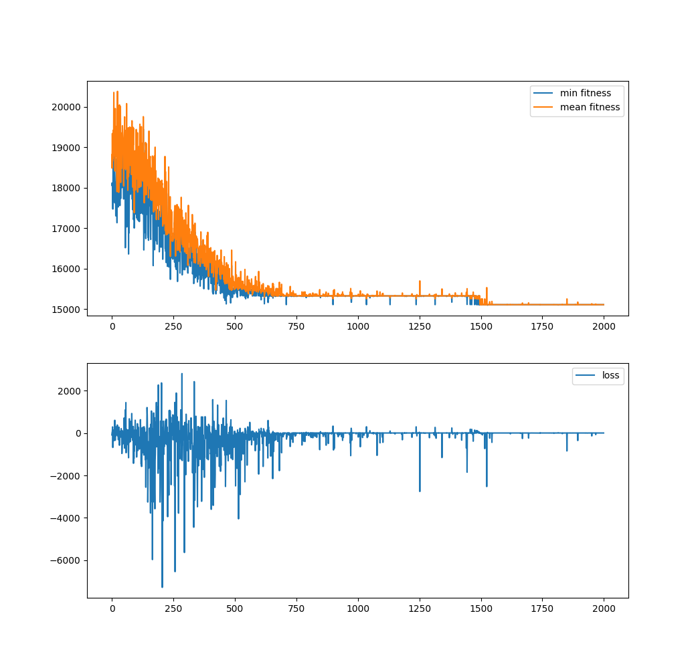
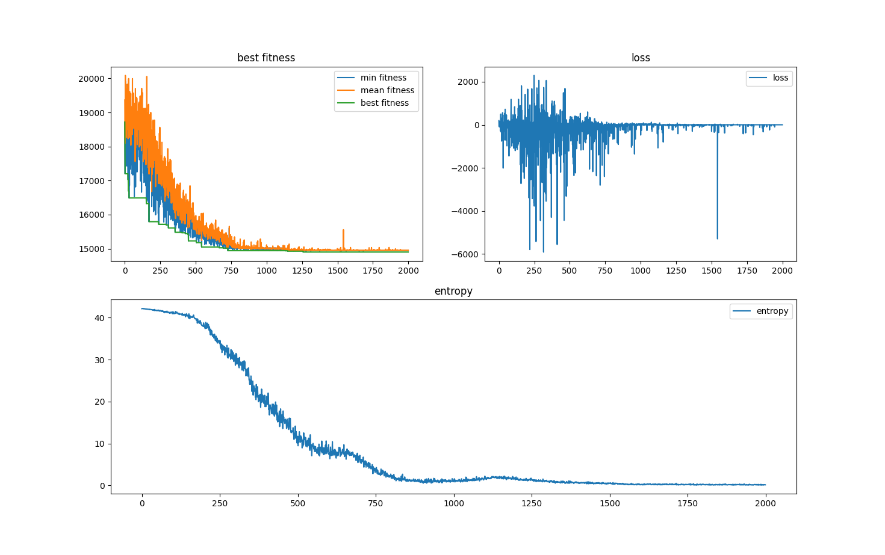
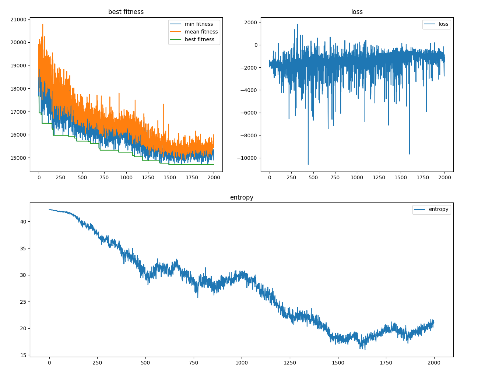
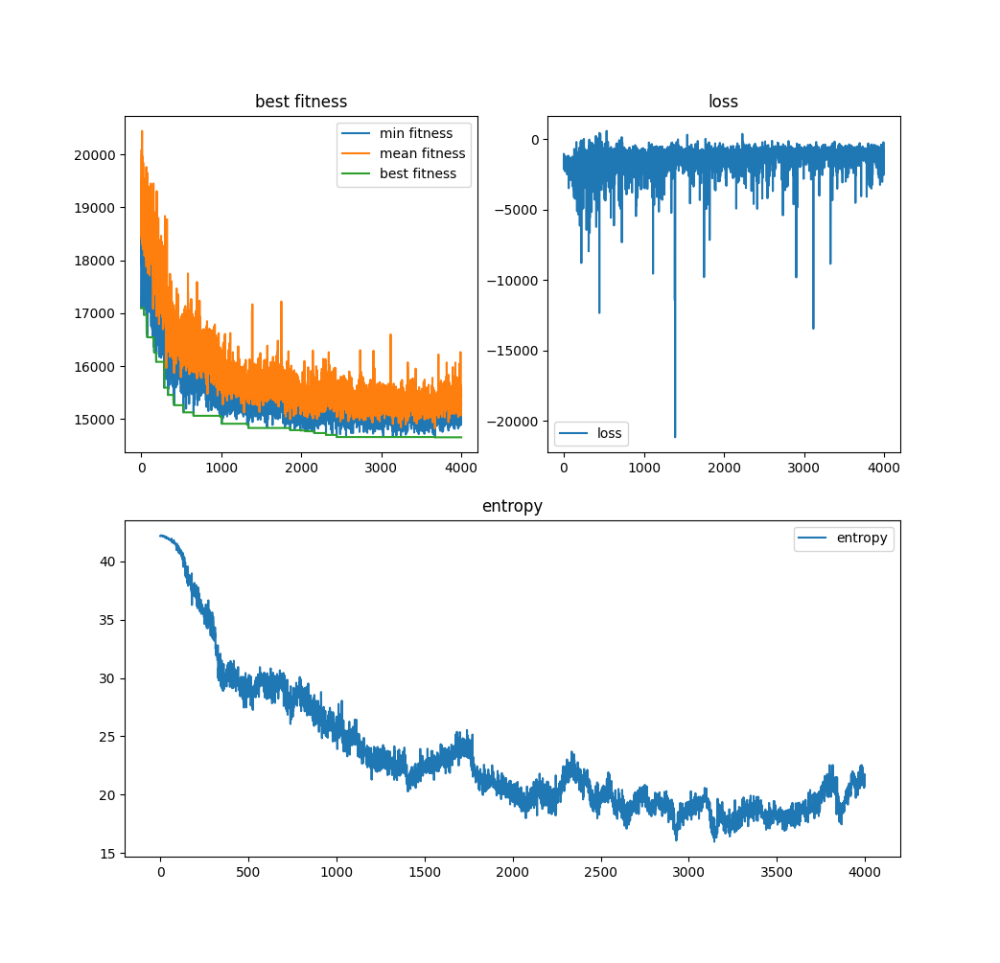
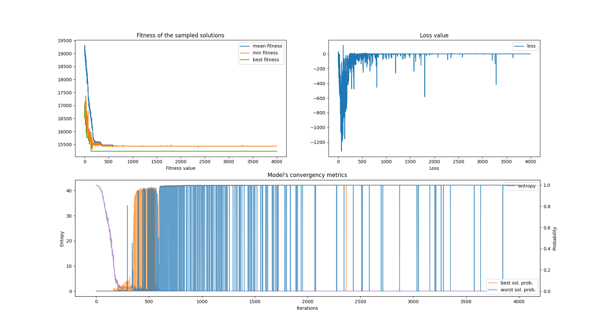
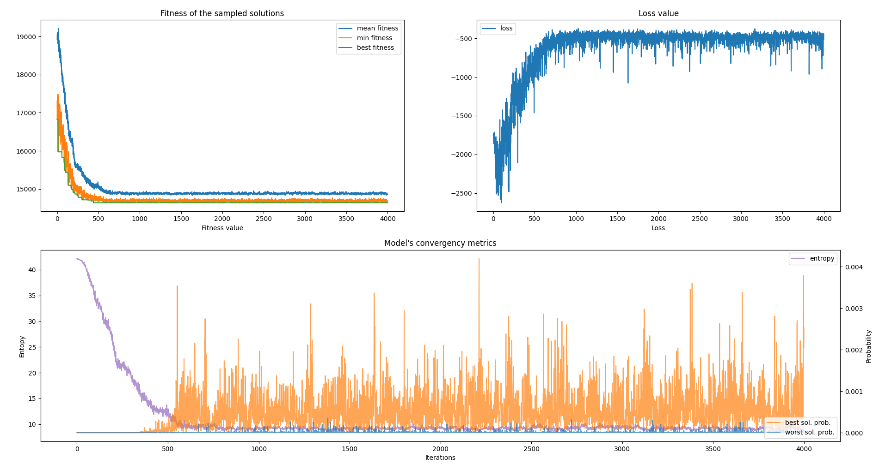
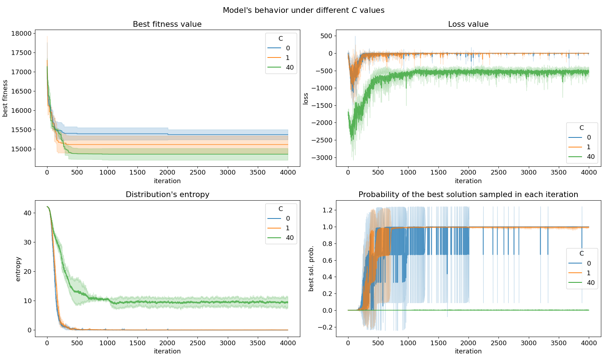
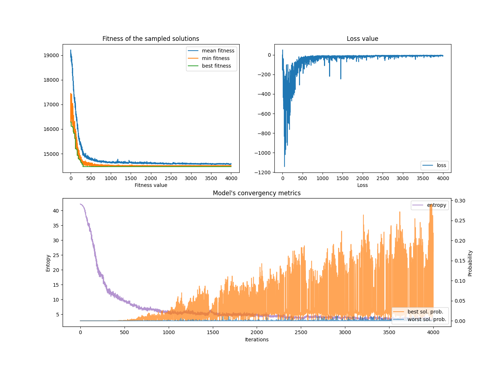
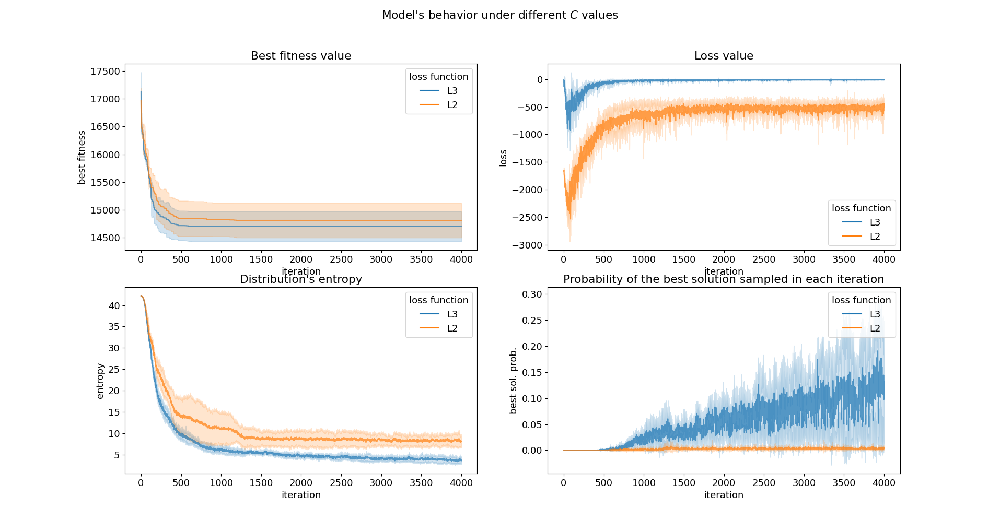

# Experimentation Results

**Important note**: Until section \textit{Experiments with model's convergency} there was an error in the code, and only $3$ solutions were sampeld from the model in each iteration (instead of the number of samples defined in the experiment setup). This caused the expected fitness value (see the loss function definition below) to be inacurate and increasing the stochasticity of the optimization process. This is a minor issue for the first experiments as their only purpose is to demonstrate that the neural network apprach works.

## Demo 1
(commit: `387333aaae049d430bc800a88731e6e70dd39359`)

### The model:
Feed-forward neural network (classic MLP):

| Layer | Type                | Num. Nodes              | Activation func. |
| ----- | ------------------- | ----------------------- | ---------------- |
| 1.    | Input / Shared      | 512                     | ReLU             |
| 2.    | Output (ModuleList) | [N-i for i in range(N)] | None             |

### Experment setup

* *lr*: .0003
* *num. samples*: 64
* *iterations*: 2000
* *noise vec. length*: 128

For this experiment the used utility function was: 

$$U(v_i) = f(v_i) - \frac{1}{m}\sum_{j=1}^m {f(v_j)}$$

The problem was *PFSP* and the instance `tai_20_5_8`.

### Results

{ width=90% }

Metrics of the last iteration:

* *best fitness*: $15095$
* *min fitness*:  $15107$
* *mean fitness*: $15107$

This experiment was just a demo to demonstrate that our approach works. However, it turned out that the obtained results were quite competitive compared to other NN experiments (model's parameters such as num. of layers nd nodes were taken arbitrarily), taking into account that state of the art meta-heuristics obtain fitness values around $1.44\times10^4$ and $1.47\times10^4$.

As can bes seen in the image, the minimun and mean fitness are practically the same from iteration 700 until the end. This suggests that the entropy of the model drops to very low values to early (premature convergence of the model).
To confirm the hipothesis, the same experiment was run, but this time collecting the entropy of the distribution the model outputs. This was the obtained graph:

 { width=90% }
 
At this point, the hipothesis was confirmed, the entropy of the model drops to almost $0$ very rapidly, thus the model converges and no exploration is done.

## More to explore! 

After the premature convergence problem was discorvered, I started thinking solutions to encourage the model to explore more. Finally the following loss function was formulated,

$$L(\theta) = L_1(\theta) - c L_2(\theta)$$
$$L_1(\theta) = \mathbb{E}_{v\sim\theta}[logP(v|x, \theta) U(v)]$$
$$L_2(\theta) = \sum_{i=1}^{N} H(v_i|x,\theta)$$

Where, $\theta$ are the parameters of the NN, $x$ is the random noise vector, $U$ is the utility function and $c$ is a constant parameter (new hyperparameter) that determiness the importance or weight of the $L_2$ loss.

### Experment setup
Hyperparametrs remain unchanged from the last experiment, but the new $c$ parameter is introduced:

* *lr*: $0.0003$
* *num. samples*: $64$
* *iterations*: $2000$
* *noise vec. length*: $128$
* $c$: $40$

For this experiment the used utility function was: 

$$U(v_i) = f(v_i) - \frac{1}{m}\sum_{j=1}^m {f(v_j)}$$

The problem was *PFSP* and the instance `tai_20_5_8`.

###  Results
 
{ width=90% }

Results are presented in Figure \ref{2020_11_08_2}. This are the fitness values in the last iteration:

* mean fitness: $15442.66$
* min fitness: $15204$
* best fitness: $14704$

The fitness values are very different from each other (in the last experiment this was no the case), suggesting that in this case the sampled solutions are more diverse. Also, looking to the results graph, the entropy value is much higher when using the new loss function. 

In order to better understand the behavior of the model under this new loss function, the same experiment was executed again, but in this case the number of iterations was set to $400$, see Figure \ref{2020_11_08_3}.
 
{ width=90% }
 
This are the fitness values in the last iteration:

* mean fitness: $15424$
* min fitness: $15305$
* best fitness: $14656$

The ad-hoc implementation of an UMDA operating under the permutation space 
reaches $1.47\times10^4$ as the best fitness value in this instance of the PFSP. **In this experiment the model outperformed the UMDA obtaining $1.46\times10^4$ as the best fitness value!**

# Experiments with model's convergency

In order to better understand the evolution of the probability distribution the model outputs over execution's iterations, distribution's entropy and the probability of the best and worst solution were recorded in each iteration. 
In the following experiments, the value of the $C$ parameter is changed in order to see how the entropy term of the new loss function affects the model. The experimental setup of this experiments is the same as in the previous section (see Section \textit{More to explore!}) 

In Figure \ref{2020_11_15_2}, training metrics are shown for single execution. In this execution the parameter $C$ was set to $0$, thus canceling the entropy term of the new loss function.

{ width=110% }

Figure \ref{2020_11_15_2} clearly shows that the model suffers for premature convergency.
Starting from the top left plot, where the fitness of the sampled solutions are presented, from iteration $900$ onwards, minimum and mean fitnesses are equal, suggesting that all (or the majority) of the sampled solutions are identical.
Continuing with the next plot (top right plot in Figure \ref{2020_11_15_2}), the loss function converges to $0$ when the minimum and mean fitness values converge. This is logical as the utility function $U(v)$ tends to $0$ when the fitness of the sampled solution is similar to the mean fitness of the sampled solutions.

{ width=110% }

Finally, the bottom plot in Figure \ref{2020_11_15_2} shows the convergency metrics of the model over the execution iterations. As can be seen, the entropy of the model rapidly drops to $0$ (note that the maximum entropy the model could have considering $n=20$, is $42.335$) in about $700$ iterations. 

If we take a look to the probability of the best sampled solution, the probability rapidly increases from almost $0$ to a $1$, and remains with the highest probability for the whole execution.
In the other hand, the probability to sample the worst sampled solution aggressively oscillates between $0$ and $1$. The probability fluctuates more in the begining of the execution and slowly becomes more and more stable. This suggests that the entropy of the model is not exactly $0$, but a value proximal to $0$, letting some small probability to sample different solutions. In other words the convergency of the model is not absolute, as there is some small probability to sample new solutions.

In order to evaluate the model's convergency with respect to the $C$ parameter (remind that $C$ is the parameter that weight's the entropy term in the loss function).
The algorithm (with the same experimental setup as the latter experiment) was executed $3$ times for each $C={0, 1, 40}$. The obtained results are shown in Figure \ref{2020_11_15_1}.

{ width=110% }

## A new way to introduce the entropy term in the loss function

In this section we explore a new way to introduce the entropy in the loss function. Thus defining a new loss function refered as $L_3$ loss.

$$L_3(\theta) = \mathbb{E}_{v\sim\theta}[logP(v|x, \theta) U(v)] \frac{H(v|x, \theta)}{max_H}$$

Where $x$ is random noise vector sampled from a uniforma probability distribution, $U(v)$ is the utility function, $H(v|x, \theta)$ is the entropy of the model's distribution and $max_H$ is the maximum entropy value the distribution over inversion vectors could have.
One inmediate benefit of the $L_3$ loss function over the last loss function is that the $C$ parameter is no longer needed, one \textit{magic} value less!

{ width=110% }

In Figure \ref{2020_11_17_2} results of a single execution are shown, the experimental setup is exactly the same as before. The only changes from the experiments in the last section are the loss function (replaced with the new $L_3$) and the ausence of the $C$ parameter.

As can be seen in the plots, the the convergency of the model is fast, but considerably smoother compared to the experiments of the last section. Also, the obtained results in this execution are also quite competitive.

{ width=110% }

## A more detailed vision of the loss function

In order to better understand the convergency of the model, we decided to make a video of how the inversion vector distribution generated by the model changes over the iterations of an execution.
This video showed that the first rows of the distribution, wich represent the probability distributions over the first elements of the inversion vectors ($P(v_0), P(v_1)$...), converge much faster than the distributions of the last elements of the inversion vectors ($P(v_{n-2}), P(v_{n-1})$).

The NN model, has an output for each position of the inversion vectors to sample. In other words, the number of outputs of the model is the same as the lenght of the solutions tosample.
Each of this outputs has a different length, the length of an output is determined by the number of different values a solution could have in a specific position: $v_i = {0, |v|-i-1}$.

Considering this constraint, the first position of an inversion vector (considering 20 the length of the vector) can hold values from 0 to 19, 20 different values in total. In the other hand, v_{17} could only hold values from 0 to 2.

Now, let's look to the gradient of the loss function: 

$$\nabla_{\theta} L(\theta) = \mathbb{E}[\nabla_{\theta} logP(v|\theta, x)f(v)] = $$
$$=\mathbb{E}[f(v)\sum_{i=0}^{|v|} \nabla_{\theta} logP(v_i|\theta, x)]$$

When expanding the gradient of the log probability of the inversion vector $\nabla_{\theta}logP(v|\theta, x)$, the gradient of the probability decomposes as the sum of the gradients of log probability of each position of the inversion vector, $logP(v|\theta, x) = \sum_{i=0}^{|v|} logP(v_i|\theta, x)$.

Note that, as mentioned before, $v_0$ is able contain up to 20 different values, on the contratry, $v_{17}$ can only contain 3 diffent values. This causes $logP(v_0|\theta, x)$ to be much greater than $logP(v_{17}|\theta, c)$, thus the gradient of the first probability distribution of $v_19$ could be much greater than the gradient of the probability distribution of $v_{17}$.

Considering a uniform probability distribution, and $n=20$, being $n$ the length of the inverison vector, the values of the log probabilities of $v_0$ and $v_{17}$ are:

$$
logP(v_0) = logP(\frac{1}{20}) = -2.995
$$
$$
logP(v_{17}) = logP(\frac{1}{3}) = -1.098 
$$

The log probability of $v_0$ (considering a uniform distribution) is almost 3 times larger than the log probability of $v_{17}$.

To better visualize this phenomenon, Figure \ref{2020_11_28_1} is presented. As the magnitude of $logP(v_0)$ is larger compared to $logP(v_{10})$, the gradient over $logP(v_0)$ is greater, thus $P(v_0)$ converges faster than $P(v_10)$, although $P(v_10)$ also is able to converge.
In the other hand, as the magnitude of $log P(v_{17})$ is much smaller compared with the log probability of $P(v_0)$ and $P(v_10)$, the $P(v_17)$ distribution never converges.
This is clearly visualized in the lower part of Figure \ref{2020_11_28_1}, the maximum probability of the $P(v_{17})$ distribution remains almost constant from the beggining of the execution, while the maximum probability of $P(v_0)$ rapidly raises to 1.

{ width=110% }

## The inverse permutation

